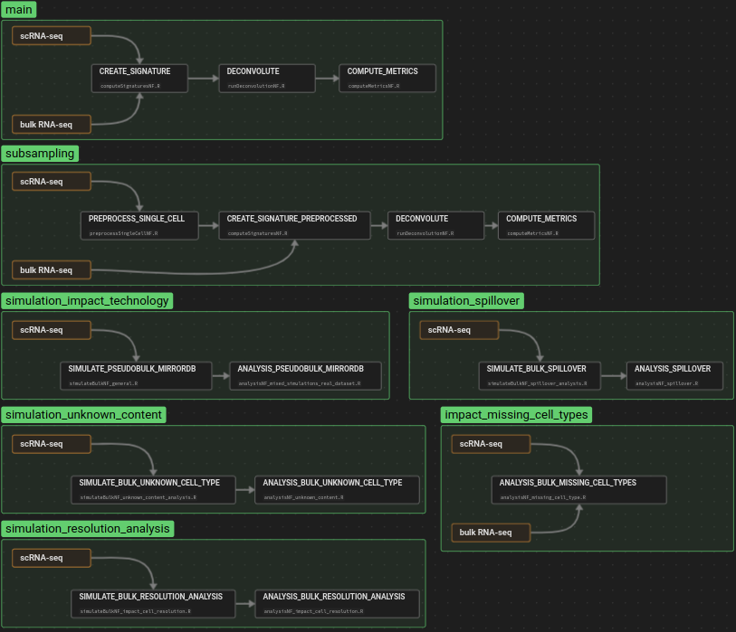

# deconvBench: a nextflow pipeline to benchmark second-generation deconvolution methods using omnideconv

For our effort to benchmark eight second-generation deconvolution methods, all included in omnideconv, we implemented a nextflow pipeline that includes several workflows. These offer different simulation scenarios and the option to deconvolve real bulk RNA-seq datasets, all with different scRNA-seq datasets, deconvolution methods and other parameters. 
A detailed description of the parameters and workflows follows below.

## Workflows

## Parameters

Parameters can be changed in the `nextflow.config` file.

### Input Directories

| Name       | Type   | Description                             | Example                      |
| ---------- | ------ | ---------------------------------- | -------------------------------- |
| `data_dir_bulk` | string | absolute path to directory that contains RNA-seq datasets | `/path/to/datasets/` |
| `data_dir_sc` | string | absolute path to directory that contains scRNA-seq datasets                          | `/path/to/other/datasets/`          |

A dedicted description of the input file formats and folder structure can be found [below](#input-formats).

### Output Directories

| Name       | Type   | Description                             | Example                      |
| ---------- | ------ | ---------------------------------- | -------------------------------- |
| `results_dir_general` | string | absolute path to directory in which final results of the `main` and `subsampling` workflow are stored | `/path/to/results/` |
| `results_dir_resolution` | string | absolute path to directory in which final results of the `simulation_resolution_analysis` workflow are stored | `/path/to/simulation_resolution_analysis/results/` |
| `results_dir_missing_cell_types` | string | absolute path to directory in which final results of the `impact_missing_cell_types` workflow are stored | `/path/to/impact_missing_cell_types/results/` |
| `preProcess_dir` | string | absolute path to directory in which temporary files are stored                          | `/path/to/temporary/directory/`          |

### General Parameters

| Name       | Type   | Description                             | Example                      |
| ---------- | ------ | ---------------------------------- | -------------------------------- |
| `ncores` | int | Number of cores that are available for methods | `4` |
| `species_sc` | string | Type of species in scRNA-seq dataset (`mm` or `hs`). Currently only supported by BayesPrism. | `hs` |

### Benchmarking Parameters [general]

| Name       | Type   | Description                             | Example                      |
| ---------- | ------ | ---------------------------------- | -------------------------------- |
| `single_cell_list` | [string] | list of scRNA-seq dataset names that will be used for deconvolution. Details for naming conventions are found [below](#input-formats). | `["hao-complete", "hao-sampled-3"]` |
| `bulk_list` | [string] |   list of RNA-seq dataset names that will be used for deconvolution. Details for naming conventions are found [below](#input-formats).                        |    `["finotello", "finotello-simulation"]`      |
| `method_list` | [string] |  list of method names that are used for deconvolution. Possible values are: `["autogenes","bayesprism","bisque","cibersortx"` `,"dwls","music","scaden","scdc"]`                         |    `["music","bayesprism"]`       |

### Workflow-specific Parameters:

The following sets of parameters are only used in the specified workflow.

####  workflow `subsampling` 

| Name       | Type   | Description                             | Example                      |
| ---------- | ------ | ---------------------------------- | -------------------------------- |
| `ct_fractions` | [numeric] | This parameter influences how large the subsets are that are drawn from the scRNA-seq dataset. There are two ways of using it: (1) Absolute number of cells, indicated by integers `>= 1`. If there are less cells available for one cell type than the number suggests, all cells of this type are selected. Otherwise, cells are drawn randomly without replacement. (2) Relative fraction of cells, indicated by numeric values in the range of `[0.001-0.999]`. This selects a subset of cells for each cell type, relative to the total number of cells in this type. | `[0.01, 0.05, 100, 500]` |
| `replicates` | int | The number of technical replicates that are drawn from the scRNA-seq dataset. Repeats the subsampling with the indicated `ct_fractions` the indicated amount of times, in order to account for technical biases during random cell sampling. | `5` |

#### workflow `simulation_impact_technology` 

| Name       | Type   | Description                             | Example                      |
| ---------- | ------ | ---------------------------------- | -------------------------------- |
| `results_dir_impact_technology` | string | absolute path to directory in which final results of the `impact_technology` workflow are stored | `/path/to/impact_technology/results/` |
| `replicates_simulation` | [int] | ---------------------------------- | `[5]` |
| `datasets_impact_technology` | [string] | ---------------------------------- | `["lambrechts","maynard]` |

#### workflow `simulation_spillover` 

| Name       | Type   | Description                             | Example                      |
| ---------- | ------ | ---------------------------------- | -------------------------------- |
| `results_dir_spillover` | string | absolute path to directory in which final results of the `simulation_spillover` workflow are stored | `/path/to/simulation_spillover/results/` |
| `spillover_samples_per_cell` | int | in the spillover analysis samples contain only one cell type. This parameter controls how many pseudo-bulk samples should be simulated that way. | `10` |
| `spillover_celltypes` | [string] | Control, for which cell types the spillover analysis will be done | `["B cells,Monocytes,NK cells,T cells CD8,T cells CD4 conv"]` |

#### workflow `simulation_unkown_content` 

| Name       | Type   | Description                             | Example                      |
| ---------- | ------ | ---------------------------------- | -------------------------------- |
| `results_dir_unknown_content` | string | absolute path to directory in which final results of the `simulation_unkown_content` workflow are stored | `/path/to/simulation_unkown_content/results/` |
| `known_cell_types` | [[string]] | subset of cell types that we will use to build the signature matrix | `[["B cells,Stromal cells,T cells CD4 conv,Macrophages"]]` |
| `unknown_cell_type` | [string] | unknown cell type to use | `["Tumor cells"]` |
| `fractions_unknown_cells` | [[int]] | Control, for which cell types the spillover analysis will be done | `[[0, 0.05, 0.1, 0.2, 0.3, 0.5, 0.7, 0.8, 0.9]]` |
| `replicates_unknown_content` | [int] | ------------------- | `[5]` |

#### workflow `simulation_resolution_analysis` 

#### workflow `impact_missing_cell_types` 

## Input Formats

## Data Normalizations